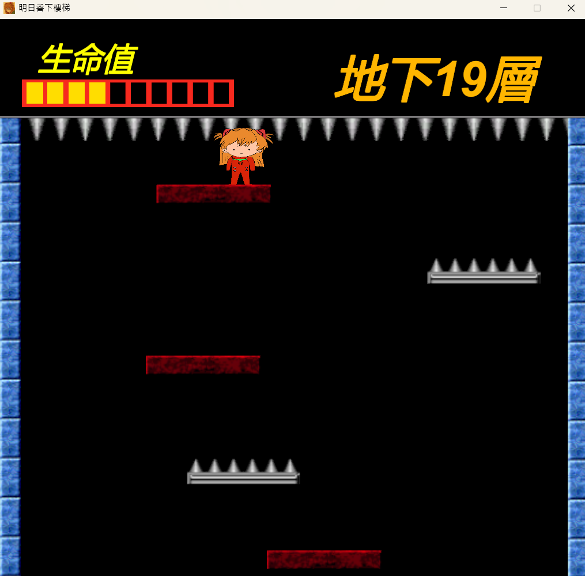
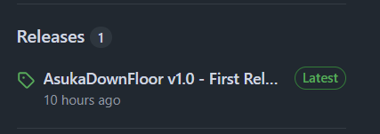
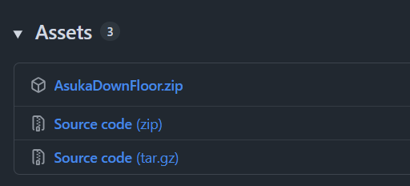

# 明日香下樓梯 AsukaDownFloor

## 遊戲介紹

本遊戲使用 Unity 遊戲引擎及 C# 程式語言開發。

核心玩法與「小朋友下樓梯」相同，不斷地下樓梯，努力存活並取得高分數！

## 如何下載

 * 第一步，點選右側 Releases 的 Latest 版本

 * 第二步，點選 "AsukaDownFloor.zip" 進行下載

 

 * 第三步，將 zip 檔案解壓縮後，點選 .exe 執行檔即可遊玩！
